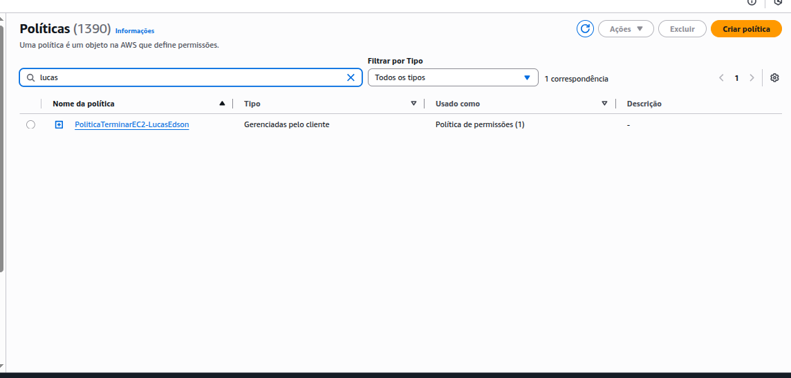
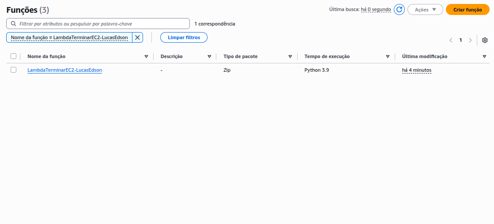
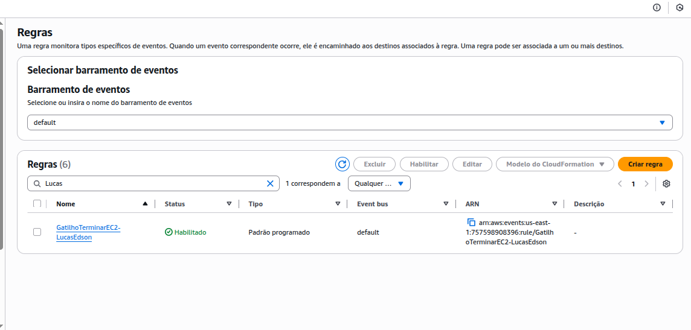
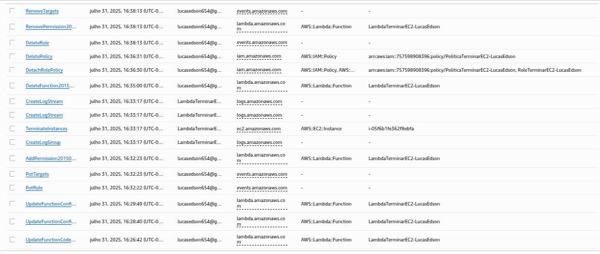

# Lab03 - Automatizando o Fim das Instâncias na AWS

## Objetivos do Laboratório
Criar e gerenciar políticas IAM e funções Lambda na AWS, com foco em automação e integração entre serviços, permitindo a execução automática via EventBridge. 
 

Passos para Conclusão do Laboratório:

Crie uma política de IAM que permita terminar instâncias EC2.

Crie uma função Lambda utilizando Python para executar a ação desejada.

Associe a política IAM criada à função Lambda.

Configure um gatilho no EventBridge para que a função Lambda seja executada automaticamente.

## Avaliação:
Print da política criada: 25 pontos

Print da função IAM criada: 25 pontos

Print do Lambda: 50 pontos

Observação: Lembre-se de que nos prints deve constar o seu nome para ser contabilizado. 

## Entrega:

[x] - Criar Policy -> `print_politicas.png`

[x] - Criar Função IAM

[x] - Criar Lambda -> `print_lambda.png`

[x] - Associar Policy ao Lambda

[x] - Associar Lambda ao EventBridge -> `print_eventbridge.png`

[x] - Remover Recursos Criados -> `print_cloudtrail.png` ou `envent_history.json`

