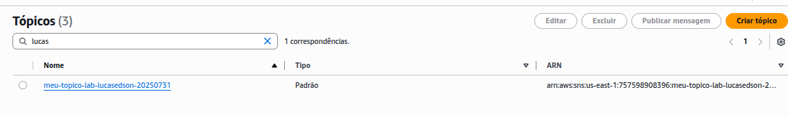
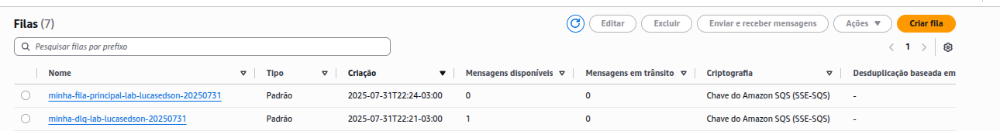
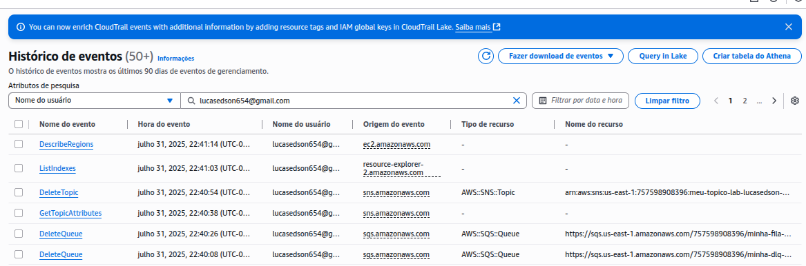
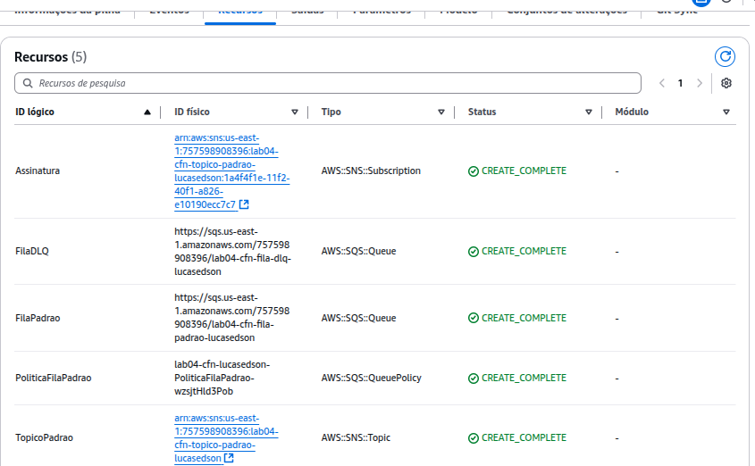
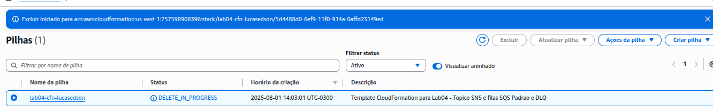

# Lab04 - Tópico SNS e filas SQS Padrão e DLQ

## Objetivos do Laboratório:
Neste laboratório, você irá criar um fluxo de mensagens desacoplado utilizando SNS (Simple Notification Service) e SQS (Simple Queue Service) com uma Dead-Letter Queue (DLQ). Esse cenário simula a arquitetura de microsserviços, onde eventos são publicados e processados de forma assíncrona, com tolerância a falhas.

### **Passos para Conclusão do Laboratório:**

Criar uma fila SQS para servir como Dead-Letter Queue (DLQ).

Criar uma fila SQS principal (Padrão).

Configurar a fila principal para usar a DLQ (Política de Redirecionamento/Redrive Policy). 

Criar um tópico SNS Padrão.

Inscrever a fila SQS principal no tópico SNS.

Testar o envio de mensagens via SNS e o recebimento na fila SQS. 

Compreender e simular o envio de mensagens para a DLQ.


**Observação: Nos prints deve constar o para que a atividade seja contabilizada.**
### Material de apoio:

Em anexo, seguem as instruções detalhadas do laboratório, assim como os arquivos que serão utilizados ao longo do processo.


## Váriaveis:

**ARN_DLQ:** arn:aws:sqs:us-east-1:757598908396:minha-dlq-lab-lucasedson-20250731
**ARN_FILA_PRINCIPAL:** arn:aws:sqs:us-east-1:757598908396:minha-fila-principal-lab-lucasedson-20250731
**ARN_TOPICO:** arn:aws:sns:us-east-1:757598908396:meu-topico-lab-lucasedson-20250731
**ARN_ASSINATURA:** arn:aws:sns:us-east-1:757598908396:meu-topico-lab-lucasedson-20250731:a698365d-b8a6-4f4f-939b-57b0c5ceada8


## Entrega:

Print do Tópico SNS criado:


Print das Filas SQS (principal) e Print das Filas SQS (DLQ):


Print dos recursos EXCLUIDOS:



## Extra:
### Criando os recursos através do CloudFormation:
**Diretório do Template:** `/iac/template.yaml`

**Template:**
```yaml
AWSTemplateFormatVersion: '2010-09-09'
Description: >-
  Template CloudFormation para Lab04 - Topico SNS e filas SQS Padrao e DLQ

Resources:
  FilaDLQ:
    Type: AWS::SQS::Queue
    Properties:
      QueueName: lab04-cfn-fila-dlq-lucasedson


  FilaPadrao:
    Type: AWS::SQS::Queue
    Properties:
      QueueName: lab04-cfn-fila-padrao-lucasedson
      RedrivePolicy:
        deadLetterTargetArn: !GetAtt FilaDLQ.Arn
        maxReceiveCount: 3

  TopicoPadrao:
    Type: AWS::SNS::Topic
    Properties:
      TopicName: lab04-cfn-topico-padrao-lucasedson

  Assinatura:
    Type: AWS::SNS::Subscription
    Properties:
      Protocol: sqs
      Endpoint: !GetAtt FilaPadrao.Arn
      TopicArn: !Ref TopicoPadrao
    

  PoliticaFilaPadrao:
    Type: AWS::SQS::QueuePolicy
    Properties:
      Queues: 
        - !Ref FilaPadrao
      PolicyDocument:
        Version: '2012-10-17'
        Statement:
          - Sid: 'OwnerStatement'
            Effect: Allow
            Principal:
              AWS: !Sub 'arn:aws:iam::${AWS::AccountId}:root'
            Action: 'SQS:*'
            Resource: !GetAtt FilaPadrao.Arn
          - Sid: 'AllowSNSSendMessage'
            Effect: Allow
            Principal:
              Service: 'sns.amazonaws.com'
            Action: 'sqs:SendMessage'
            Resource: !GetAtt FilaPadrao.Arn
            Condition:
              ArnEquals:
                aws:SourceArn: !Ref TopicoPadrao
```

**Criando a stack:**
```bash
aws cloudformation create-stack --stack-name lab04-cfn-lucasedson --template-body file://iac/template.yaml
```

**Saída:**



**Exclusão do recurso:**
