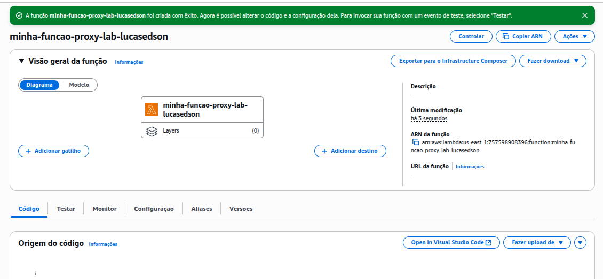
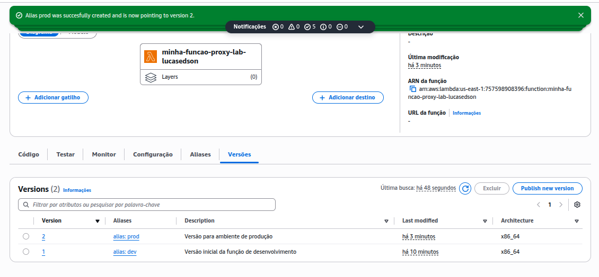
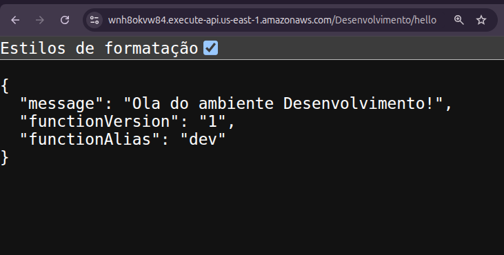
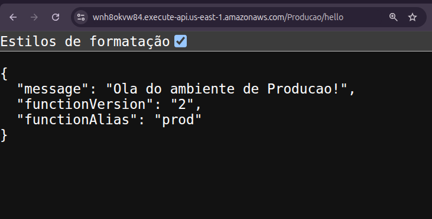
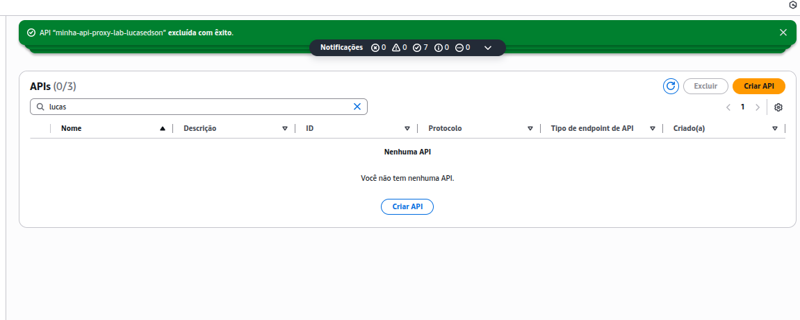
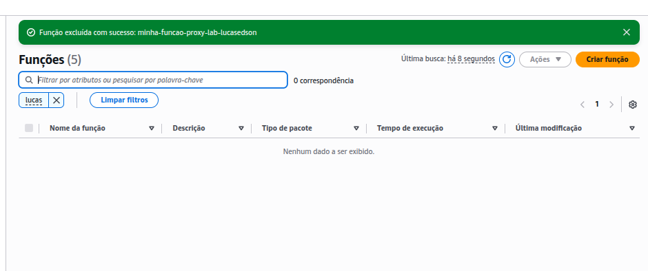

# Lab05 - Laboratório - AWS Lambda  com Aliases e API Gateway com Stages

Neste laboratório, você irá configurar uma arquitetura serverless organizada por ambientes (como desenvolvimento e produção), utilizando e . Essa abordagem permite controlar o ciclo de vida da aplicação com segurança e agilidade.

### Passos para Conclusão do Laboratório:

- Criar uma função AWS Lambda compatível com a integração Proxy do API Gateway.
- Publicar pelo menos duas versões da função Lambda para representar diferentes estados do código.
- Criar Aliases no Lambda (ex: dev, prod) apontando para versões específicas da função.
- Criar uma API REST no API Gateway.
- Configurar a integração do tipo Proxy entre a API Gateway e a função Lambda.
- Criar Stages no API Gateway (ex: Desenvolvimento, Producao) representando os ambientes.
- Integrar cada Stage com o Alias correspondente da função Lambda.
- Testar os endpoints dos Stages (/dev, /prod) para garantir que cada um acione a versão correta da função Lambda.
- Compreender os benefícios do uso combinado de Aliases (Lambda) e Stages (API Gateway) para o gerenciamento do ciclo de vida e implantação controlada de aplicações serverless.

### Avaliação:
Print com versões e Aliases criados no Lambda – 25 pontos
Print dos Stages no API Gateway - 25 pontos
Print dos testes realizados nos endpoints /dev e /prod com as respostas distintas – 25 pontos
Print dos recursos deletados (API gateway e Lambda) - 25 pontos

----

## Entrega:
[X] - Criação da Função AWS Lambda

[X] - Publicação de Versões e Criação de Aliases

[X] - Criação e Configuração do API Gateway

[X] - Recursos Deletados

