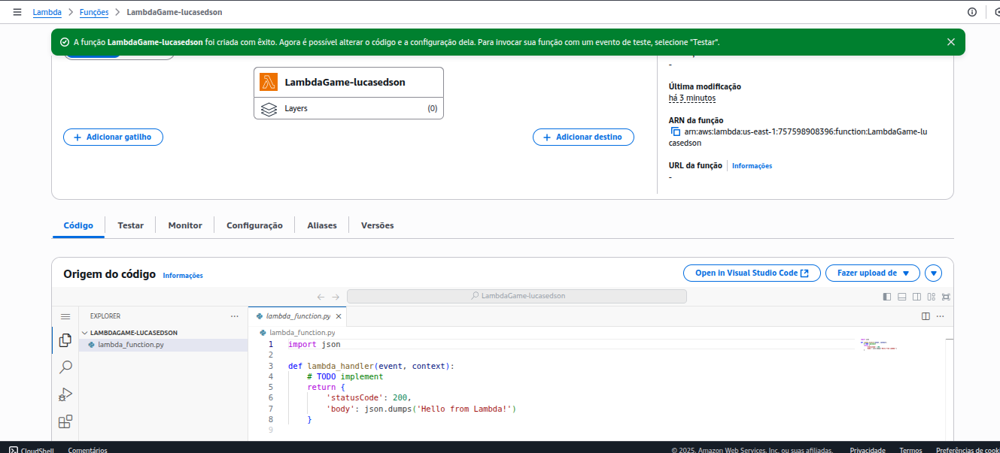
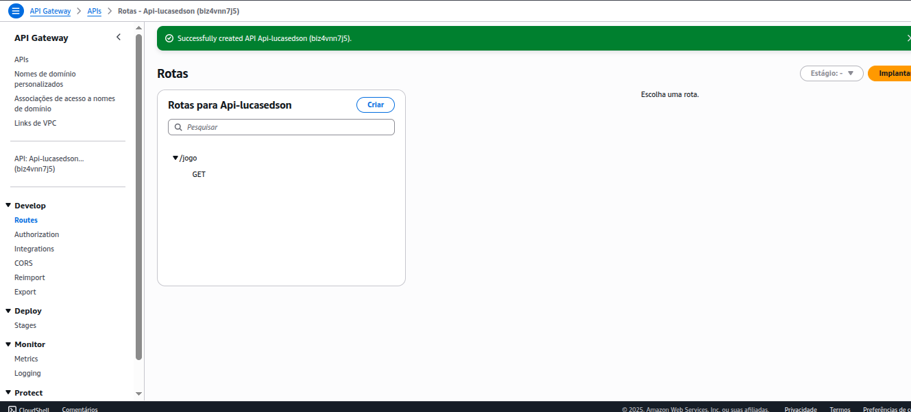
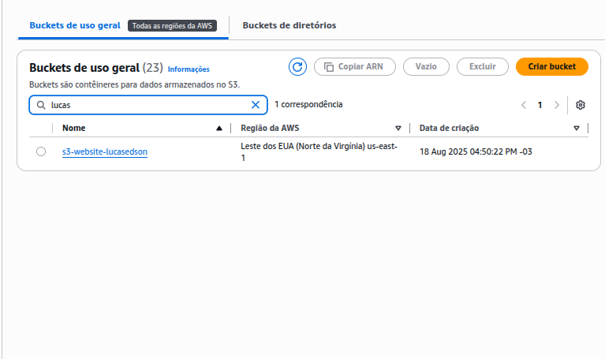
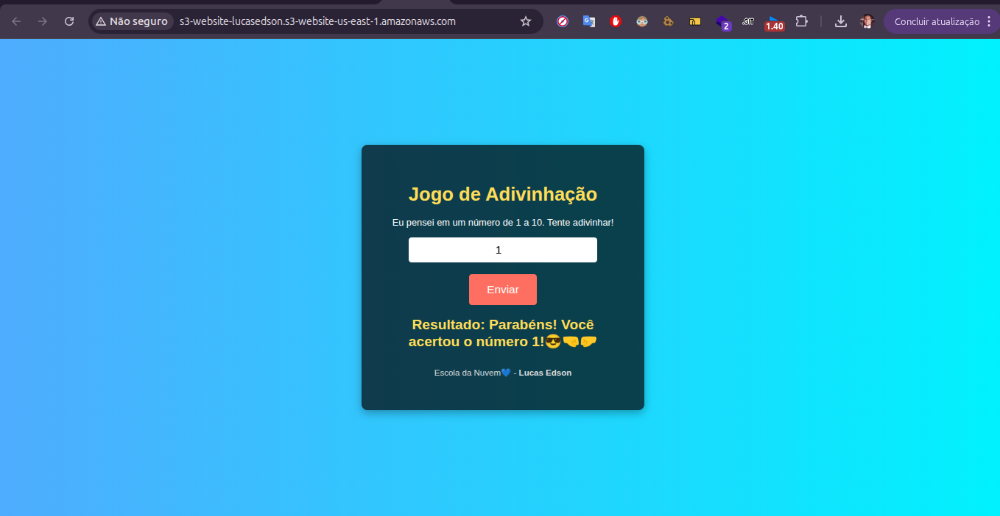
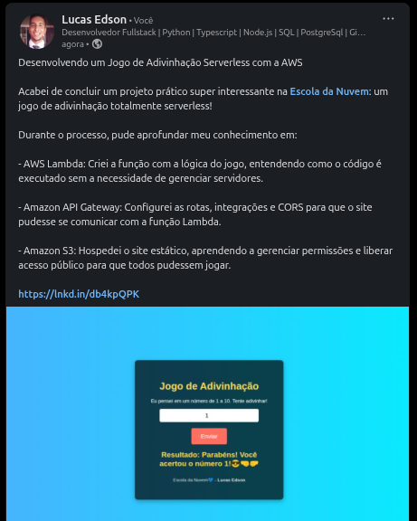

# Lab06 - Laboratório - Jogo de Adivinhação com AWS Lambda, API Gateway e S3

Criar e gerenciar uma aplicação serverless na AWS, integrando múltiplos serviços para desenvolver um jogo de adivinhação simples, onde o usuário tenta adivinhar um número entre 1 e 10.

Passos para Conclusão do Laboratório:

- Criar a função Lambda com a lógica do jogo.
- Criar e configurar a API Gateway (rotas, integrações, CORS).
- Conectar o site à API usando a URL gerada.
- Personalizar o site com seu nome ao lado de “Escola da Nuvem💙”.
- Fazer upload do site (index.html) no S3.
Liberar acesso público ao bucket e ativar a hospedagem de site estático.

## Entrega:

[X] - Criação da Função AWS Lambda

[X] - Criação da API Gateway

[X] - Criação do Bucket S3

[X] - Criação do Site

[X] - Publicação no LinkedIn - [Link](https://www.linkedin.com/posts/lucasedson_desenvolvendo-um-jogo-de-adivinha%C3%A7%C3%A3o-serverless-activity-7363304033224114178-ljVY?utm_source=share&utm_medium=member_desktop&rcm=ACoAACDx6VEBrX2kfc4BWwYsg4MXrZMVdxaJbKk)
