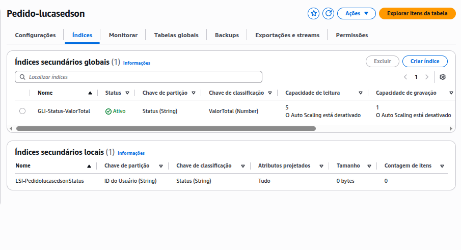

# Lab07 - DynamoDB GLI e LSI

Este laboratório prático orienta a criação de uma tabela NoSQL no Amazon DynamoDB. Os participantes irão configurar a estrutura da tabela com chave de partição e de ordenação, criar índices secundários locais (LSI) e globais (GSI), inserir dados manualmente e via terminal (CloudShell), e executar consultas utilizando diferentes critérios. O exercício também inclui a análise de performance de leitura e a remoção de recursos criados.

Este laboratório ensina como configurar:
Tabela no DynamoDB: Criar uma tabela com chave de partição e ordenação.
Índices Secundários: Adicionar um índice secundário local (LSI) e um índice secundário global (GSI) para possibilitar diferentes tipos de consultas.
Inserção e Consulta de Dados: Popular a tabela manualmente e via terminal, e realizar buscas com base em diferentes atributos.
Análise de Performance: Avaliar como os índices afetam a eficiência das consultas.

Limpeza de Recursos: Excluir índices e a tabela ao final do laboratório.

### Avaliação:
- Print da Tabela no DynamoDB criado: 20 pontos

- Print do Índice Secundário Local (LSI) criado: 40 pontos

- Print do Índice Secundário Global (GSI) criado: 40 pontos

----

## Entrega:
Print dos recursos criados:

