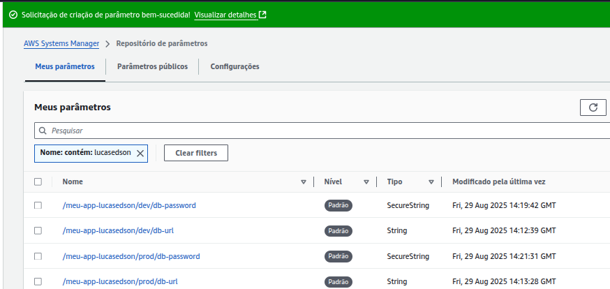
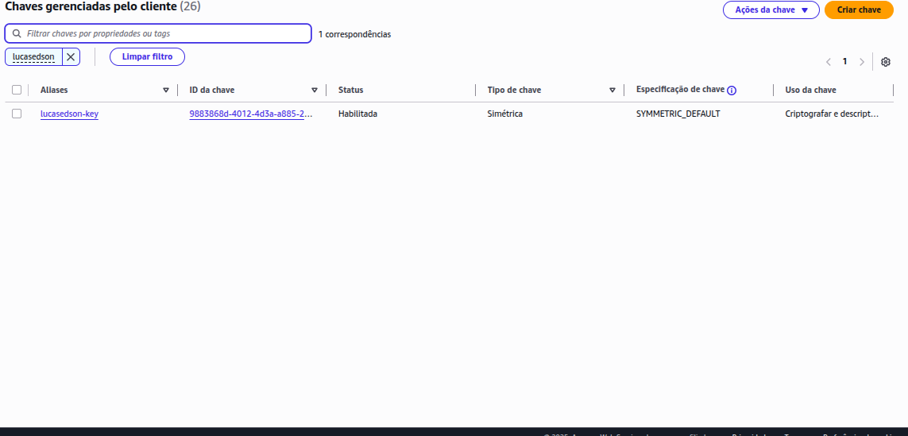
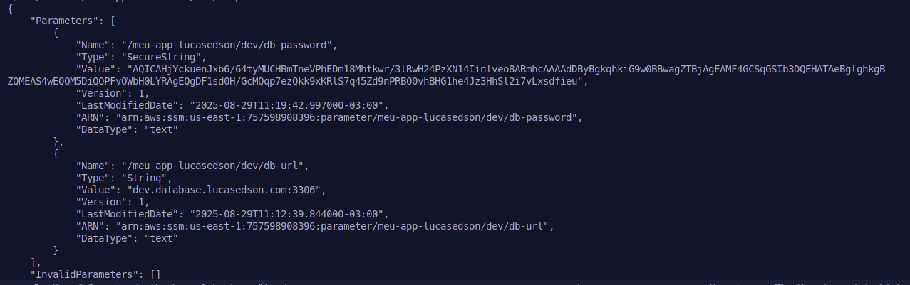
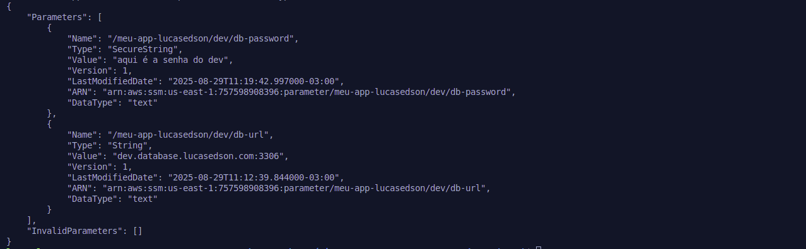

# SSM Parameter Store Hands on (CLI )

Neste laboratório prático, você aprenderá a criar e gerenciar parâmetros utilizando o AWS Systems Manager Parameter Store, incluindo parâmetros seguros criptografados com chaves do KMS (AWS Key Management Service), além de acessar os valores por meio da AWS CLI no CloudShell.

Passos para Conclusão do Laboratório:

Criar parâmetros do tipo String e SecureString no Parameter Store.
Criar uma chave de criptografia (CMK) no KMS para proteger os parâmetros sensíveis.
Recuperar os parâmetros por meio da AWS CLI, utilizando comandos com e sem a opção de descriptografia.
Navegar e visualizar os parâmetros diretamente no console do AWS Systems Manager.

## Avaliação:

Print dos parâmetros criados no Parameter Store – 50 pontos

Print da chave criada no KMS  – 50 pontos

Não se esqueçam de excluir os recursos
Em anexo, seguem as instruções detalhadas do laboratório.

## Entrega:
Parametros criados no Parameter Store:

Chave criada no KMS:

## Output da AWS CLI:

Saida da AWS CLI criptografada:

Saida da AWS CLI descriptografada:

