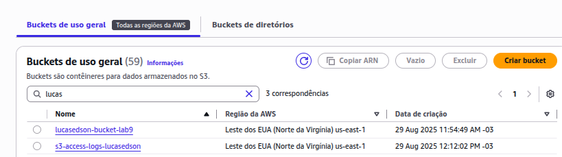
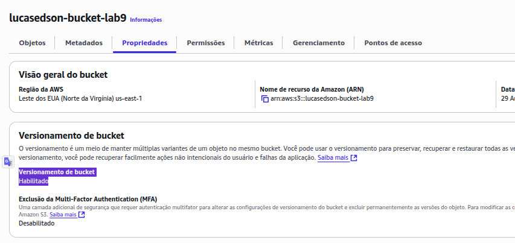
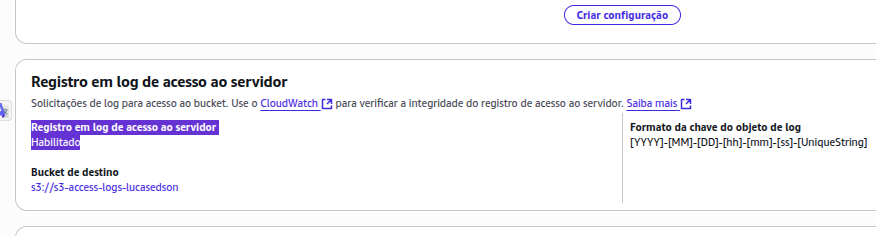
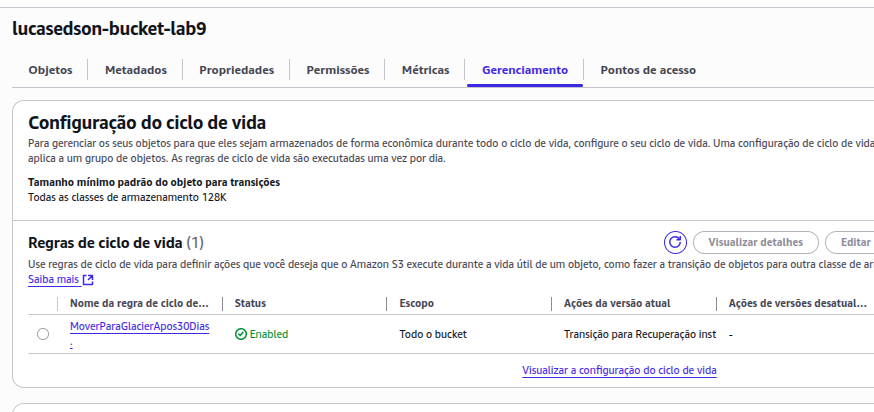

# Lab09 - Laboratório - Amazon S3 Basico, Avançado e Acesso a Logs

Neste laboratório prático, você aprenderá a utilizar os principais recursos do Amazon S3 voltados à organização, segurança e gerenciamento eficiente de dados. Serão abordadas práticas recomendadas para criação de buckets com configurações seguras, controle de versões de arquivos, automação de regras de ciclo de vida e geração de URLs pré-assinadas para compartilhamento temporário e seguro de objetos. Além disso, será demonstrada a ativação e configuração do servidor de logs de acesso, utilizando um segundo bucket dedicado ao armazenamento dos registros de operação.

## Passos para Conclusão do Laboratório:

Criar buckets no Amazon S3 com configurações recomendadas de segurança.

Ativar e utilizar o versionamento para manter múltiplas versões de arquivos.

Configurar regras de ciclo de vida para transição e expiração de objetos.

Gerar URLs pré-assinadas para compartilhamento seguro e temporário de arquivos.

Ativar e consultar logs de acesso utilizando um segundo bucket.

### Avaliação:
Print dos buckets criados - 25 pontos

Print do  versionamento ativado - 25 pontos

Print do  registro em log de acesso ao servidor ativado  - 25 pontos

Print do  regras do ciclo de vida criada   - 25 pontos

----

### Entrega:

Pritns dos buckets criados:

Print do  versionamento ativado:

Print do  registro em log de acesso ao servidor ativado:

Print do  regras do ciclo de vida criada:
