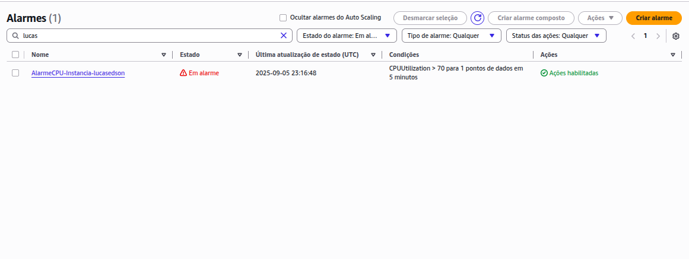
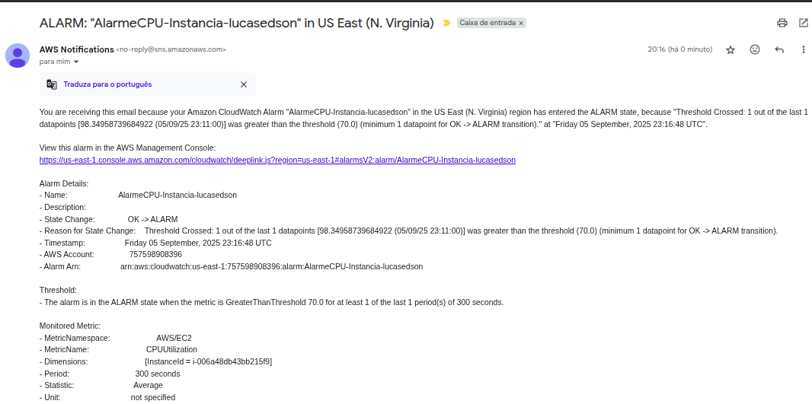

# Lab10 - Laboratório - Monitoramento e Auditoria com CloudWatch e CloudTrail na AWS

Este laboratório prático orienta a criação de um ambiente de monitoramento e auditoria na AWS. Os participantes irão configurar alarmes para monitorar a utilização de CPU em uma instância EC2, habilitar o rastreamento de atividades da conta com o AWS CloudTrail e visualizar logs armazenados em um bucket S3. O exercício também inclui o envio de notificações por e-mail usando o Amazon SNS.

### Este laboratório ensina como configurar:
Alarme CloudWatch: Monitorar
a CPU de uma instância EC2 e enviar notificações por e-mail (SNS) quando um limite for atingido.

CloudTrail: Habilitar a
auditoria (rastreamento de eventos) na sua conta AWS e armazenar os logs em um bucket S3.

Visualização de Logs: Acessar os logs do CloudTrail via S3 ou CloudWatch Logs.

### Cenário

Você precisa monitorar o desempenho de uma instância
EC2 e ser alertado sobre alta utilização de CPU. Também é necessário manter um
registro de auditoria de todas as atividades na sua conta AWS para segurança e
conformidade.

### Avaliação:
Print do alarme CloudWatch criado com status "Em alarme" – 50 pontos
Print do e-mail de notificação enviado pelo SNS – 50 pontos
Em anexo, seguem as instruções detalhadas do laboratório. Como também exemplos do prints que devem ser tirados.

## Entrega:

Print do Alarme:

Print do E-mail:

